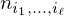
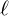
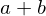
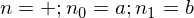
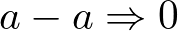
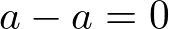
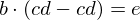
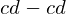
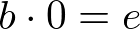

# Symbolic reasoning

## Outline

* Motivation
* Definitions
* Basics
  * fit and apply
  * Brut-force solver
* Networks for pattern recognition
  * Bias
  * FC
  * LSTM
  * ...
* Fits vs best fit and generation of synthetic trainings/test data
* Using memory
* Applications to [real world problems](./real_world_problems/README.md)
* Results
* Outlook

## Definitions

Each term is defined by its nodes  where  is the level of the node.
The term  with the content  is then represented by 

Further more one has to distinguish if a sub-term  is fixed one.
Which means can we use it as variable or is a constant or pre-defined operator.

## Example

Consider the following equation

=e.png)

and the following replacement rule



which comes directly out of the equation



When trying to apply this rule on the equation above results in the fitting try of the abstract term  in one of the nodes of the formula .

The fitting result would be that the rule fits in the node  and the mapping cd_150.png" />.

Applying this fitting result on the initial equation would transform it to

=e_300.png)

where `a = cd`.

with the conclusion this results in



.

You can find this example as a [e2e test](./libcore/src/apply.rs#L328-L347) from line 149.

## Abstract

Rule

F(a,b) -> G(a)

## Minimal examples with Derivations

### Polynomial

```math
D(x^n, x) => n*x^(n-1)
```

## Implementation

This project contains.

* [Calculation Generator](./generator)
* [Machine Learning](./ml)