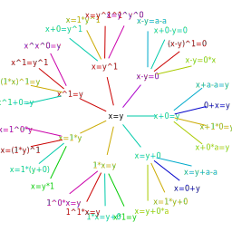

# Generator

The generator generates based on some rules random calculations and records it's trace.

## Motivation

In order to get a large test set the generated calculation can be used for training.

## Implementation

### Overview

To generate new terms the inverted rules get applied to the initial terms.

This leads to the following chain deducing new terms only using one rule each:

There are several challenges:

1. How to introduce new variables or terms? Example: Consider the rule  `0 => a - a`. What is `a`?
2. How to filter out uninterested derived terms? This leads to: How to define a metric of interest?

### Details

#### Challenging problem 1

As a first attempt all leafs of the previous terms get used as a potential new symbol for the deduced symbol.

#### Challenging problem 2

[Todo]