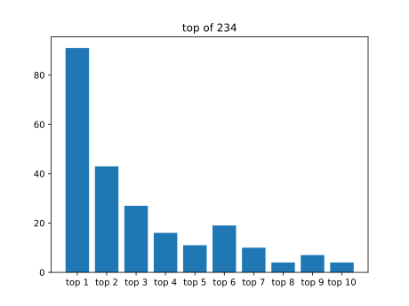
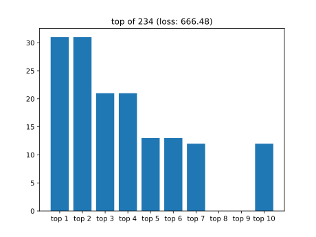

# Machine Learning approaches

## Rule prediction

Based on initial symbols string.
No path prediction.
Using 2 fully connected layers.



## LSTM

Example:

Given the term

* s = a
* s_0 = b
* s_1 = c

```python
o_b, h_b, r_b = model(b, 0, 0)
o_c, h_c, r_c = model(c, 0, 0)

_  , h_a, r_a = model(a, 0, r_b)
o_a, h_a, r_a = model(a, h_a, r_c)

# Get max output o_i where i in [a,b,c]
```

If the transformation rule does not apply to the root (here `a`) then ignore the rest of the term.




### TODO

* Running on GPU
* Prediction of path